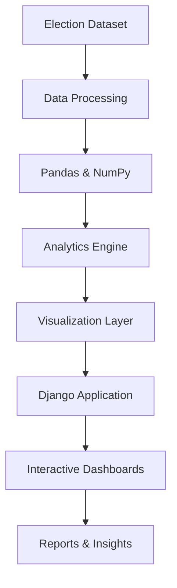

<p align="center">
  
</p>

<h3 align="center">
Transforming Electoral Data into Interactive Insights
</h3>

<p align="center">
  
  
  
  
  
  
</p>

---

## Overview

Election Intelligence Platform is a web-based analytics solution designed to explore, visualize, and analyze electoral datasets through interactive dashboards and constituency-level intelligence.

The platform enables users to evaluate election outcomes, compare political party performance, analyze vote and seat distribution, and identify regional trends through data-driven visualizations and reporting.

By combining analytics, visualization, and reporting capabilities into a unified application, the platform provides a structured environment for understanding complex electoral data.

---

## Application Preview

> Replace these screenshots with your own project screenshots.

<p align="center">
  
  
</p>

<p align="center">
  
  
</p>

---

## Core Capabilities

### Election Analytics

- State-Level Analysis
- Constituency-Level Analysis
- Candidate Performance Evaluation
- Political Party Performance Tracking
- Comparative Election Analysis

### Data Visualization

- Vote Share Analytics
- Seat Share Distribution
- Interactive Dashboards
- Electoral Trend Analysis
- Performance Comparison Reports

### Reporting

- Election Summary Reports
- Constituency Reports
- Analytical Insights
- Structured Data Exploration

### Data Management

- Historical Election Dataset Integration
- Data Processing & Transformation
- Election Record Management
- Dataset Exploration

---

## Technology Stack

| Category | Technologies |
|-----------|-------------|
| Backend | Django, Python |
| Data Processing | Pandas, NumPy |
| Analytics | Scikit-Learn |
| Visualization | Matplotlib, Seaborn |
| Data Handling | OpenPyXL |
| Database | SQLite |

---

## System Architecture



## Analytics Modules

| Module | Description |
|----------|------------|
| Vote Share Analytics | Analyze voting distribution across parties |
| Seat Share Analytics | Evaluate winning seats and party dominance |
| Constituency Intelligence | Constituency-level performance insights |
| Performance Analytics | Compare political and regional performance |
| Election Reporting | Generate structured analytical reports |

---

## Project Structure

```text
Election-Intelligence-Platform
│
├── Dashboard
├── Analytics
├── Vote Share Analysis
├── Seat Share Analysis
├── Constituency Intelligence
├── Reports
├── Feedback Module
├── Dataset Explorer
└── Data Processing Components
```

---

## Installation

### Clone Repository

```bash
git clone https://github.com/mrravi07/ExitPollPro-Django.git

cd ExitPollPro-Django
```

### Install Dependencies

```bash
pip install -r requirements.txt
```

### Apply Database Migrations

```bash
python manage.py migrate
```

### Load Election Dataset

```bash
python manage.py loadelection2019
```

### Run Application

```bash
python manage.py runserver
```

Visit:

```text
http://127.0.0.1:8000
```

---

## Roadmap

- Multi-Election Year Analytics
- Geographic Election Mapping
- Predictive Election Analytics
- Automated Reporting
- AI-Assisted Election Insights
- Advanced Comparative Analytics

---

## Author

### Ravi Kumar Singh

Data Engineer | AI Engineer

💼 LinkedIn  
www.linkedin.com/in/ravi-kumar-singh-99777a2a6

💻 GitHub  
github.com/mrravi07

---

<p align="center">
  <b>Election Intelligence Platform</b><br>
  Analytics • Visualization • Insights
</p>

<p align="center">
  
</p>
