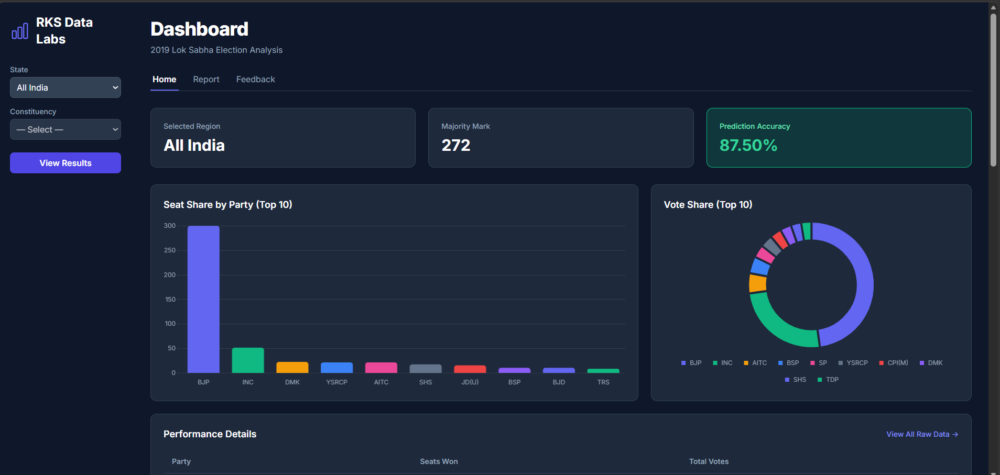
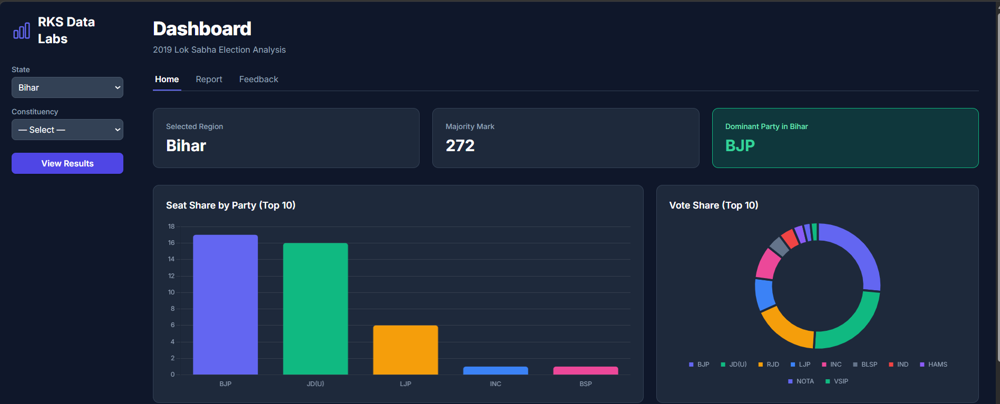
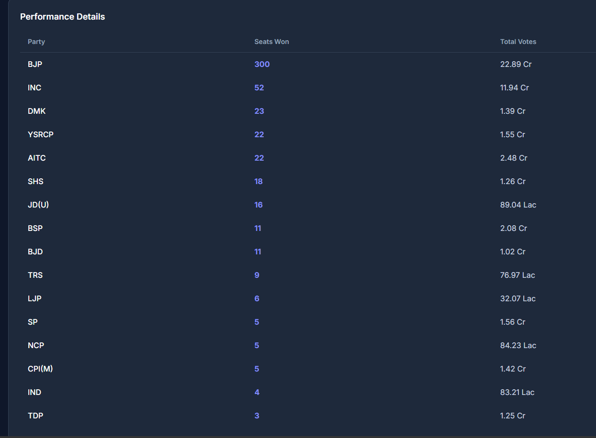
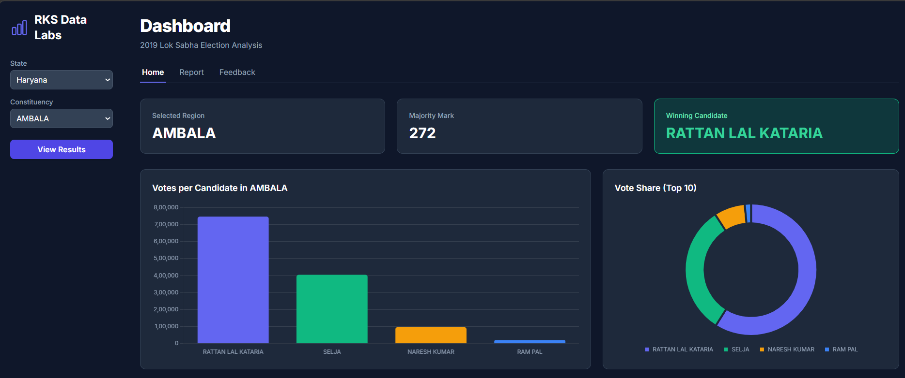
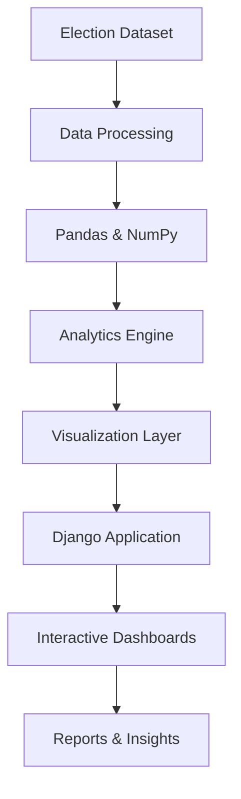

<p align="center">
  
</p>

<h3 align="center">
Transforming Electoral Data into Interactive Insights
</h3>

<p align="center">
  
  
  
  
  
  
</p>

---

# 📊 Overview

Election Intelligence Platform is a Django-based analytics application designed to explore, analyze, and visualize election data through interactive dashboards and constituency-level insights.

The platform enables users to evaluate vote share, seat share, party performance, and election outcomes using data-driven analytics and visualization techniques.

---

# ✨ Key Features

### 📈 Election Analytics
- State-wise Election Analysis
- Constituency-wise Analysis
- Candidate Performance Evaluation
- Political Party Performance Tracking
- Comparative Election Analysis

### 📊 Interactive Dashboards
- Vote Share Analysis
- Seat Share Distribution
- Election Trend Visualization
- Performance Comparison

### 📋 Reporting
- Election Summary Reports
- Constituency Reports
- Analytical Insights
- Structured Data Exploration

### 🗄️ Data Management
- Historical Election Dataset Integration
- Data Processing & Transformation
- Election Record Management

---

# 🖼️ Application Preview

<p align="center">
  
  
</p>

<p align="center">
  
  
</p>

---

# 🏗️ System Architecture



# ⚙️ Technology Stack

| Category | Technologies |
|-----------|-------------|
| Backend | Django, Python |
| Data Processing | Pandas, NumPy |
| Analytics | Scikit-Learn |
| Visualization | Matplotlib, Seaborn |
| Data Handling | OpenPyXL |
| Database | SQLite |

---

# 📂 Project Structure

```text
Election-Intelligence-Platform
│
├── ExitPollPro/
├── dashboard.png
├── analytics.png
├── vote-share.png
├── report.png
├── requirements.txt
└── README.md
```

---

# 🚀 Installation

### Clone Repository

```bash
git clone https://github.com/mrravi07/ExitPollPro-Django.git

cd ExitPollPro-Django
```

### Install Dependencies

```bash
pip install -r requirements.txt
```

### Apply Database Migrations

```bash
python manage.py migrate
```

### Load Election Dataset

```bash
python manage.py loadelection2019
```

### Run Development Server

```bash
python manage.py runserver
```

Open:

```text
http://127.0.0.1:8000
```

---

# 📊 Analytics Modules

| Module | Description |
|----------|------------|
| Vote Share Analytics | Analyze voting distribution across parties |
| Seat Share Analytics | Evaluate winning seats and party dominance |
| Constituency Intelligence | Constituency-level performance insights |
| Performance Analytics | Compare political and regional performance |
| Election Reporting | Generate structured analytical reports |

---

# 🔮 Future Enhancements

- Multi-Election Year Analysis
- Geographic Election Mapping
- Real-Time Election Data Integration
- Predictive Election Analytics
- AI-Assisted Election Reporting
- Advanced Comparative Analytics

---

# 👨‍💻 Author

### Ravi Kumar Singh

**Data Engineer | AI Engineer**

💼 LinkedIn  
https://www.linkedin.com/in/ravi-kumar-singh-99777a2a6

💻 GitHub  
https://github.com/mrravi07

🌐 Portfolio  
https://mrravi07.vercel.app

---

<p align="center">
  <b>Election Intelligence Platform</b><br>
  Analytics • Visualization • Insights
</p>

<p align="center">
  
</p>
